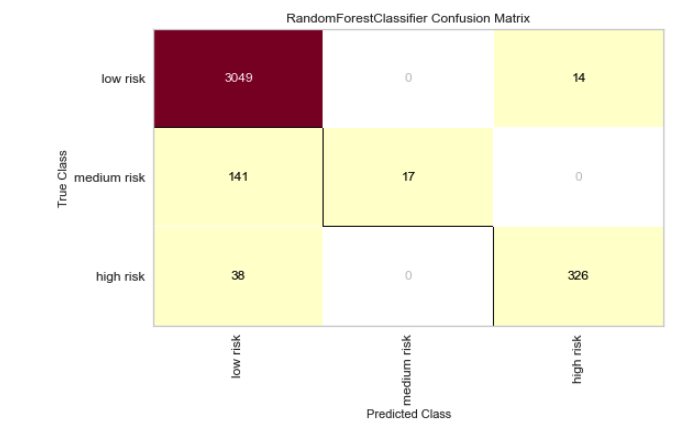
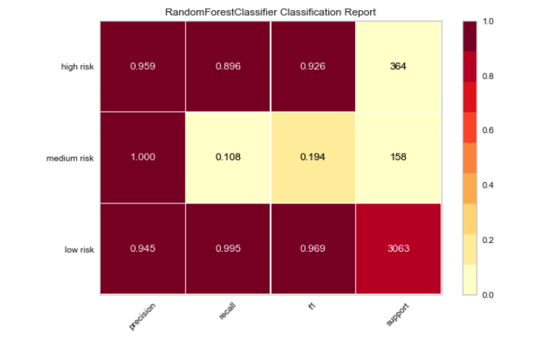

# Content

- [Content](#content)
  - [Overview](#overview)
    - [The Data](#the-data)
    - [Deliverables](#deliverables)
  - [EDA](#EDA)
  - [Model](#model)
  - [Database](#database)
    - [Web App](#web-app)
    
 

This study was done as part of Galvanize cohort in collaboration with two other peers. The objective is to help a new e-commerce site to try to weed out fraudsters. Deliverables include but are not limited to exploratory data analysis, build  proper machine learning models and presenting the solution as well as building a sustainable software project that can be hand off to the companies engineers by deploying the final model in the cloud.  

## Overview
### The Data
The data is confidential and can not be shared outside of Galvanize. The training data has 14337 rows and 44 features. The second part of the data comes from a live API that is utalized for predictions and is saved in the data base.

### Deliverables 
* EDA
* Classification model building
* Flask app with documented API
    * Query live data from server 
* Web based front-end to enable quick triage of potential fraud
    * Triage importance of transactions (low risk, medium risk, high risk)

### EDA
- Step 1:
Loaded the data with pandas. Added a 'Fraud' column that contains numeric values 0,1,2 depending on if the event is fraud. If `acct_type` field contains the word `fraud`, that point is considered 'High Risk' or 2, if the field is `premium`, the label is 'Low Risk' or 0 and everything else is considered 'Medium Risk' or 1.
86.3 % of the data is low risk, 4.7% are spammer and TOS voilators and 9% is fraudulent.

- Step 2:
Using latitude and longitude to visualize the data distribution. Seems most of the transactions in Asia are fraudulent.

- Step 3:
Data warngling:
* NaN values are replaced with KNN imputaion values
* These string type features are dropped: `'description'`, `'ticket_types'`, 
                  `'org_desc'`, `'name'` and`'listed'`.
* These string type features are one hot encoded:  `'country'`,`'currency'`, `'email_domain'`,`'org_name'`,
            `'payee_name'`,`'venue_address'`,`'venue_country'`,`'venue_name'`,
            `'venue_state'`, `'payout_type`'
* `previous_payouts` column is converted into integer values that indicates the length of previous payouts. 

### Model
The model will be used only the first step in the fraud identification process. It won't be used to declare a ground truth about fraud or not fraud, but simply to flag which transactions need further manual review.  A triage model of what are the most pressing (and costly) transactions is built.

#### Comparing models
* Base Model: I first started with an XGBoost classifier and a Random Forest model.  
* Ultimate Model: After hyper parameter tuning and cross-validation, the best model that can predict the fraudulent activities more accurately is a random forest with following classification reports on the test data:

### Database

Each prediction the model makes on new examples, is stored in a MongoDB database.
Database schema reflects the form of the raw example data and an added for the predicted probability of fraud.

#### Web App

A Flask App is created that allows the user to insert CSV files of raw data and get fraud prediction for each row in return. 

There is also an option to connect to live data and recieve predictions of client API input every few minutes.

Each precition is saved in the datbase as well as the raw data inputs.

